# 1.简介

TZ是一个由golang开发跨全平台，集主机发现，漏洞扫描，漏洞利用为一体的内网渗透工具。

配合cs插件生态，目标是为了做到内网渗透 all in one

## 1.1 cobaltstrike插件加载

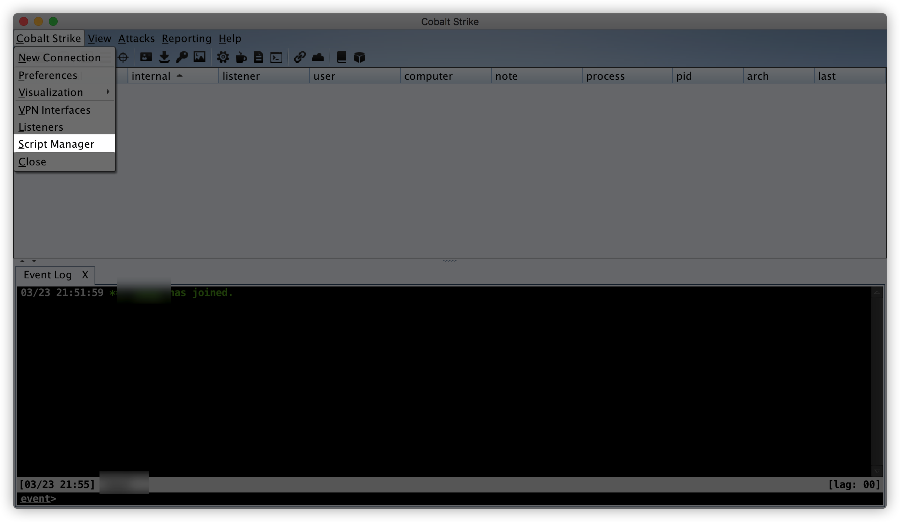

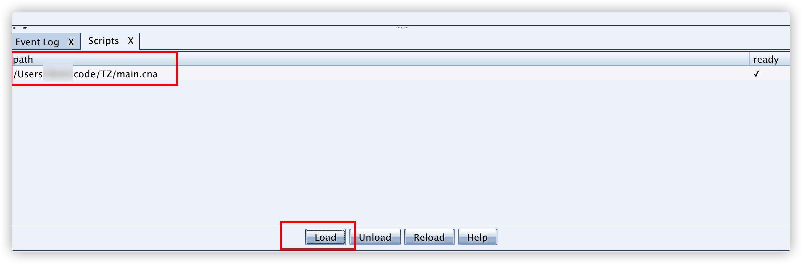

在被控主机上使用TZ之前，请先初始化TZ,会将TZ文件上传到客户端`c:\windows\temp\`下，方便后期实用

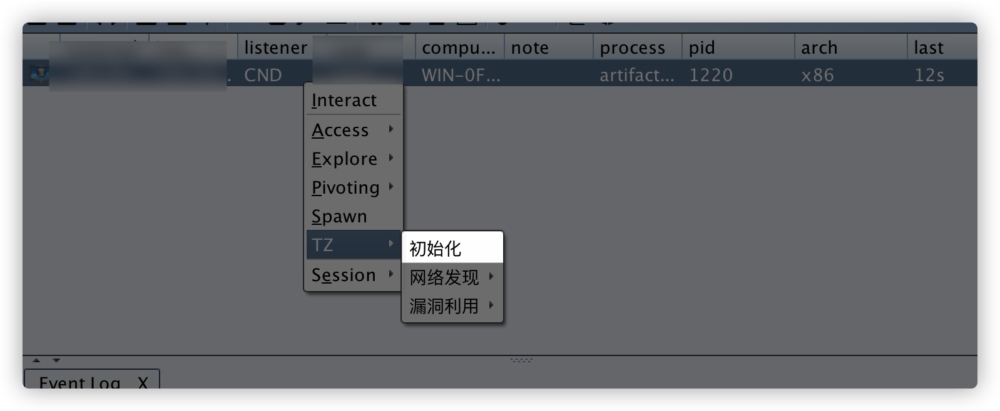

## 1.2.公共参数介绍：

```
 -c string
    	c
  -ip string
    	ip list
  -p string
    	PlusName
  -port string
    	port
  -t int
    	thread (default 8)
```

`-ip`  目标ip，Examples：`192.168.3.1或者192.168.3.1/24`

`-p`  调用插件名称

`-t` 线程数，默认为8

`-port` 目标端口，部分插件无此参数

## 1.3 目录结构

```
|____res              资源文件夹
| |____server					frp linux客户端
| |____server.exe			frp window客户端
|____main.exe					TZ window客户端
|____main.cna					cs插件文件
|____main							TZ linux客户端
```

## 1.4 开发计划

- [ ] weblogic扫描
- [ ] 提权辅助插件
- [ ] shiro利用
- [ ] ....

# 3. Scan plus

## 3.1 FuzzPortScan 全端口扫描

FuzzPortScan 1-65535全端口扫描

Examples:`main.exe -p FuzzPortScan -ip 127.0.0.1`


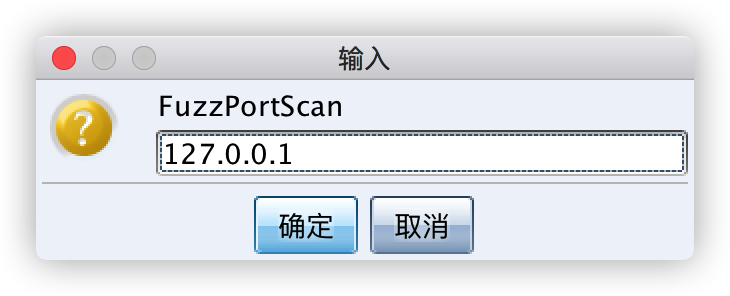

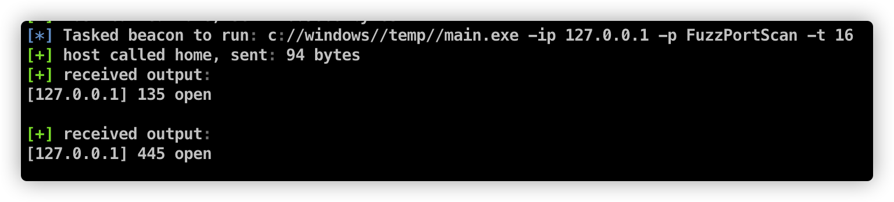

## 3.2 ImcpScan

ImcpScan imcp探测主机存活，使用ping命令探测主机是否存活

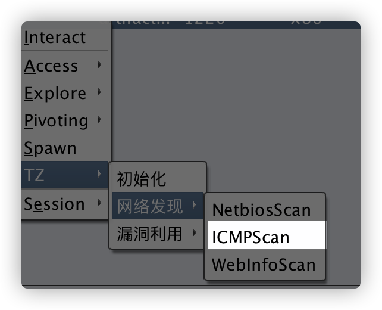

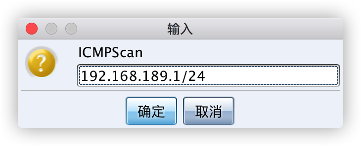


## 3.3 Ms17010Scan

MS17_010 永恒之蓝漏洞扫描

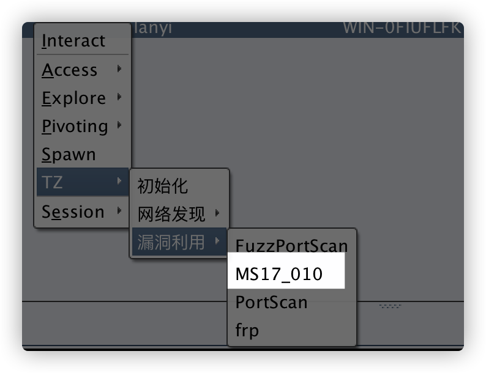

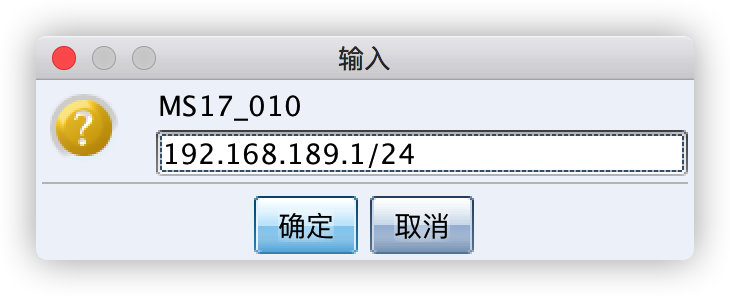

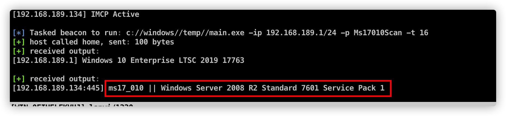

## 3.4 NetbiosScan

Netbios扫描，可用于探测存活主机，获取存活主机名，隐蔽性强。


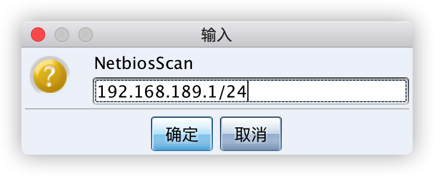

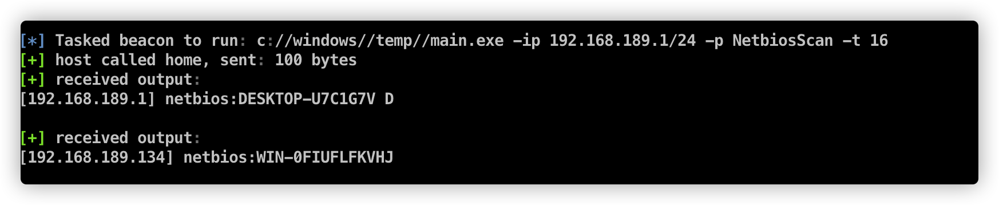


## 3.6 SmbGhostScan

远程扫描SmbGhost漏洞，漏洞编号CVE-2020-0796,考虑到实际效果，暂未集成到CS菜单，可通过命令行使用

`shell c://windows//temp//main.exe -ip 192.168.189.1/24 -p SmbGhostScan -t 16`

## 3.5 WebInfoScan web信息扫描

扫描`"80", "81", "443","888", "7001", "8080", "8888","17001", "18080","8081"`端口中开放的WEB服务并获取Title

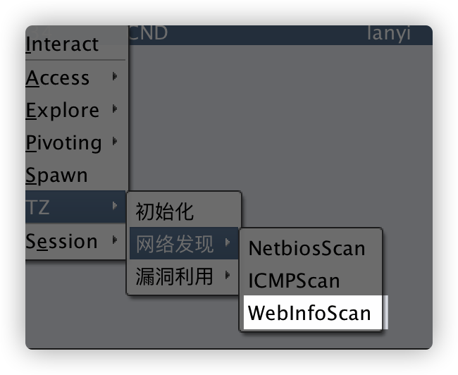

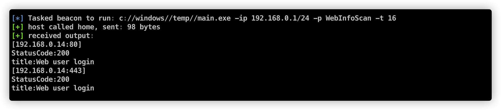

## 3.6 PingGateway 快速探测存活网段

ping IP为1，254结尾的主机，快速探测存活网段

Examples:`main.exe -p PingGateway -ip 192.168.189.1/24 -t 24`

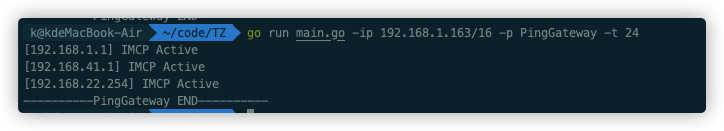

CS插件路径  `网络发现->探测网段`

# 4.Exploit plus

所有crack插件，使用字典文件爆破时，字典文件均需包含`.txt`,插件才能识别是使用字典爆破，否则会当成单一密码处理。

## 4.1 FTP_crack ftp弱口令爆破

ftp弱口令破解

使用账号密码

Examples:`main.exe -p FTP_crack -ip 192.168.189.1/24 -p 21 -c ftp:ftp`

使用字典破解,字典文件需自行上传到被控主机上

Examples:`main.exe -p FTP_crack -ip 192.168.189.1/24 -port 21 -c username.txt:password.txt`

或者

Examples:`main.exe -p FTP_crack -ip 192.168.189.1/24 -port 21 -c root:password.txt`

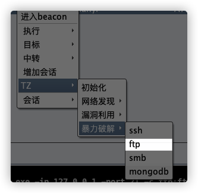

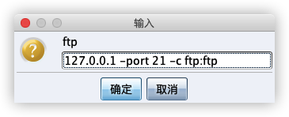

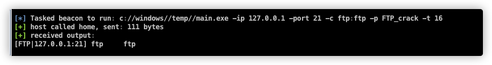

## 4.2 MONGODB_crack mongodb弱口令爆破

mongodb弱口令爆破

## 4.3 SMB_crack smb弱口令爆破

smb弱口令破解

## 4.4 SSH_crack ssh弱口令爆破

ssh弱口令爆破

使用账号密码

Examples:`main.exe -p SSH_crack -ip 192.168.189.1/24 -port 22 -c root:root`

使用字典破解,字典文件需自行上传到被控主机上

Examples:`main.exe -p SSH_crack -ip 192.168.189.1/24 -port 22 -c username.txt:password.txt`

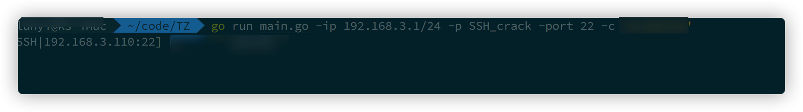

## 4.5 Redis_crack redis弱口令爆破

redis弱口令爆破

使用密码爆破

Examples:`main -p Redis_crack -ip 192.168.189.1/24 -port 6379 -c password -t 1`

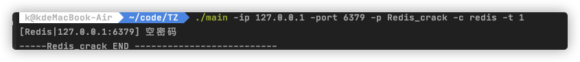

使用字典破解,字典文件需自行上传到被控主机上

Examples:`main.exe -p SSH_crack -ip 192.168.189.1/24 -port 22 -c username.txt:password.txt`

## 4.6 Frp 内网打洞

在服务器上设置frp服务端如下，token可自定义，server port可自定义。然后启动frp服务器端，后续会在1w-2w这个范围内随机生成一个端口号来建立socket5服务器，注意在服务端设置好安全组放行。

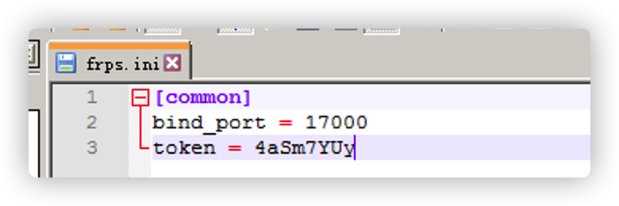

点击frp，点击以后会卡住是正常现象，因为此时在上传frp客户端

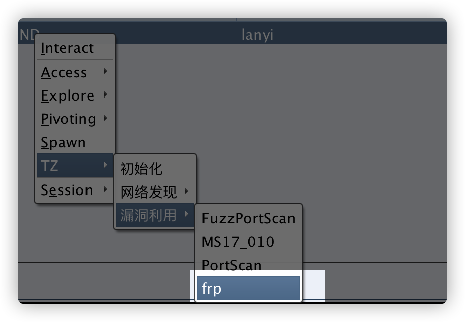

填写frp服务端ip，以及端口

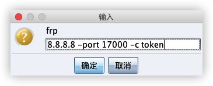

会使用frp启动socks5代理，将内网代理出来。

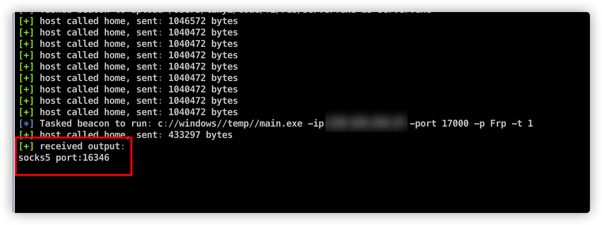

通过TZ启动的frp客户端，连接参数使用AES强加密并使用随机密钥，避免服务器连接信息泄露

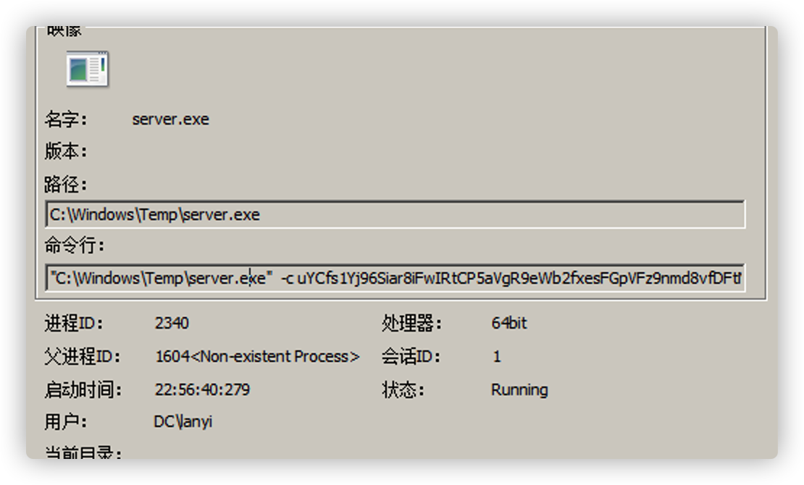


## 4.7 PortScan 端口扫描

常见端口扫描，默认扫描一下端口

```
{"22", "80,", "81", "135", "139", "443", "445", "1433", "3306", "3389", "6379", "7001", "8009 ", "8080","9200", "17001"}
```


可通过 `-c` 参数来指定想要扫描的端口，使用`,`分割

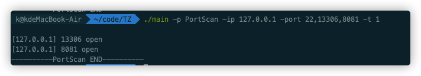

## 4.8 mysql弱口令破解

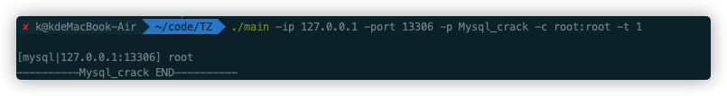

# 5.获取TZ

功能持续更新ing......


