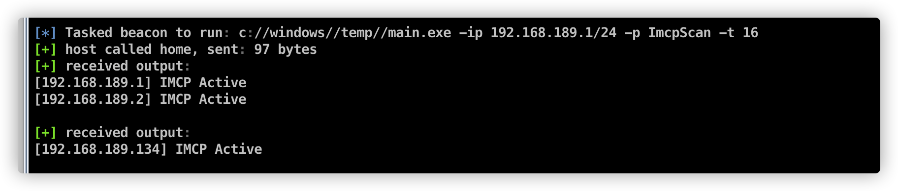
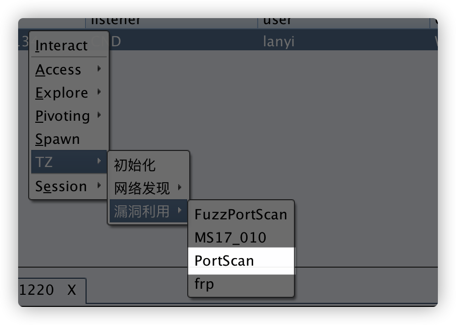
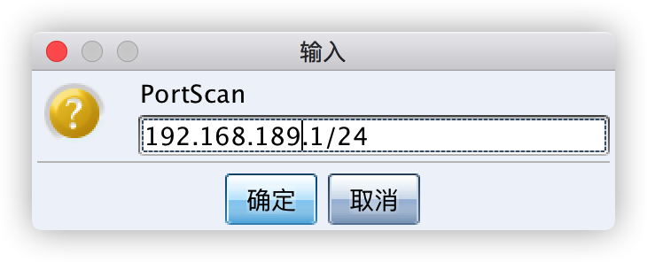
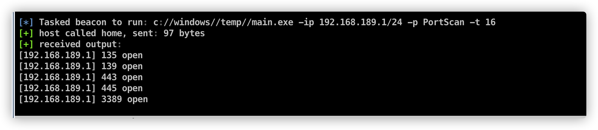

# 1.简介

TZ是一个由golang开发跨全平台，集主机发现，漏洞扫描，漏洞利用为一体的内网渗透工具。

配合cs插件生态，目标是为了做到内网渗透 all in one

## 1.1 cobaltstrike插件加载


在被控主机上使用TZ之前，请先初始化TZ,会将TZ文件上传到客户端`c:\windows\temp\`下，方便后期实用


## 1.2.公共参数介绍：

```
 -c string
    	c
  -ip string
    	ip list
  -p string
    	PlusName
  -port string
    	port
  -t int
    	thread (default 8)
```

`-ip`  目标ip，Examples：`192.168.3.1或者192.168.3.1/24`

`-p`  调用插件名称

`-t` 线程数，默认为8

`-port` 目标端口，部分插件无此参数

# 3. Scan plus

## 3.1 FuzzPortScan

FuzzPortScan 1-65535全端口扫描

Examples:`main.exe -p FuzzPortScan -ip 127.0.0.1`


## 3.2 ImcpScan

ImcpScan imcp探测主机存活，使用ping命令探测主机是否存活




## 3.3 Ms17010Scan

MS17_010 永恒之蓝漏洞扫描


## 3.4 NetbiosScan

Netbios扫描，可用于探测存活主机，获取存活主机名，隐蔽性强。


## 3.5 PortScan

常见端口扫描，默认扫描一下端口

`{"22", "80,", "81", "135", "139", "443", "445", "1433", "3306", "3389", "6379", "7001", "8009 ", "8080","9200", "17001"}`







## 3.6 SmbGhostScan

远程扫描SmbGhost漏洞，漏洞编号CVE-2020-0796,暂未集成到CS菜单，可通过命令行使用

`shell c://windows//temp//main.exe -ip 192.168.189.1/24 -p SmbGhostScan -t 16`

## 3.7 WebInfoScan

扫描`"80", "81", "443","888", "7001", "8080", "8888","17001", "18080","8081"`端口中开放的WEB服务并获取Title


# 4.Exploit plus

## 4.1 FTP_crack

ftp弱口令破解

使用账号密码

Examples:`main.exe -p FTP_crack -ip 192.168.189.1/24 -p 21 -c ftp:ftp`

使用字典破解,字典文件需自行上传到被控主机上

Examples:`main.exe -p FTP_crack -ip 192.168.189.1/24 -port 21 -c username.txt:password.txt`

或者

Examples:`main.exe -p FTP_crack -ip 192.168.189.1/24 -port 21 -c root:password.txt`

## 4.2 MONGODB_crack

mongodb弱口令破解

## 4.3 SMB_crack

smb弱口令破解

## 4.4 SSH_crack

ssh弱口令破解

使用账号密码

Examples:`main.exe -p SSH_crack -ip 192.168.189.1/24 -port 22 -c root:root`

使用字典破解,字典文件需自行上传到被控主机上

Examples:`main.exe -p SSH_crack -ip 192.168.189.1/24 -port 22 -c username.txt:password.txt`


# 5.获取TZ

功能持续更新ing......


