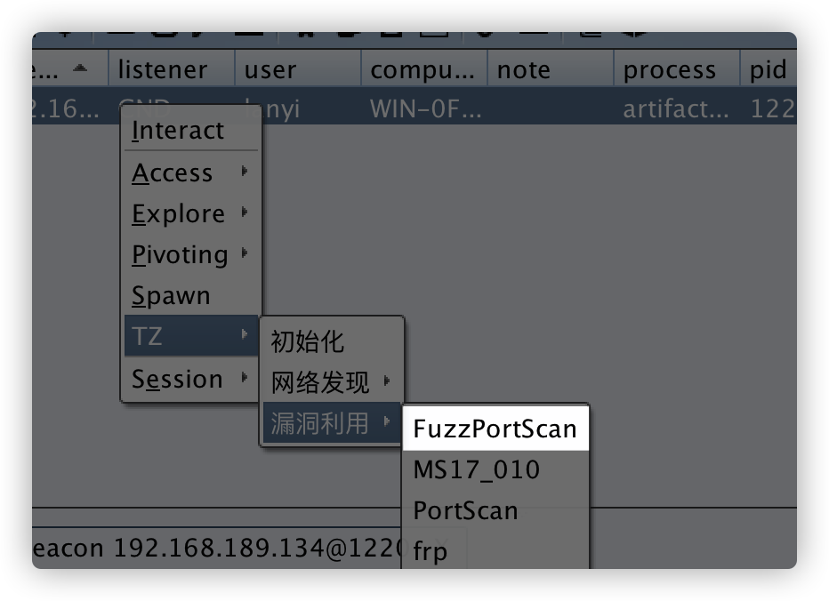
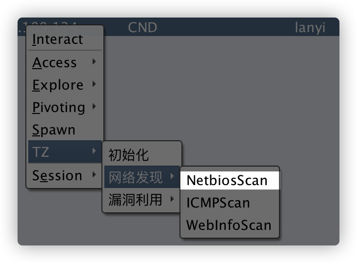

# 简介

TZ是一个由golang开发跨全平台，集主机发现，漏洞扫描，漏洞利用为一体的内网渗透工具。

配合cs插件生态，目标是为了做到内网渗透 all in one

## cobaltstrike插件加载


在被控主机上使用TZ之前，请先初始化TZ,会将TZ文件上传到客户端`c:\windows\temp\`下，方便后期实用


## 公共参数介绍：

`-ip`  目标ip，Examples：`192.168.3.1或者192.168.3.1/24或者192.168.1.1-192.168.3.1`

`-p`  调用插件名称

`-t` 线程数，默认为64

`-o` 结果输出到文件

exp插件特有参数

`-port` 目标端口，部分插件无此参数

## 梭哈:

调用全部插件进行漏洞发现，内网刷分。

大力出奇迹，内网必出洞！


# Scan plus

## FuzzPortScan 全端口扫描

FuzzPortScan 1-65535全端口扫描

Examples:`main.exe -p FuzzPortScan -ip 127.0.0.1`




## IcmpScan

IcmpScan imcp探测主机存活，使用ping命令探测主机是否存活


## Ms17010Scan

MS17_010 永恒之蓝漏洞扫描


## NetbiosScan

Netbios扫描，可用于探测存活主机，获取存活主机名，隐蔽性强。




## SmbGhostScan

远程扫描SmbGhost漏洞，漏洞编号CVE-2020-0796,考虑到实际效果，暂未集成到CS菜单，可通过命令行使用

`shell c://windows//temp//main.exe -ip 192.168.189.1/24 -p SmbGhostScan -t 16`

## WebScan

webscan插件中包括了webtitle插件，同时会检测xray poc以及tomcat和weblogic爆破等插件。

因为weblogic存在防爆破机制，所以默认只会尝试weblogic,weblogic123两个密码

tomcat会尝试 top1000

效果如图：


## PingGateway 快速探测存活网段

ping IP为1，254结尾的主机，快速探测存活网段

Examples:`main.exe -p PingGateway -ip 192.168.189.1/24 -t 24`


CS插件路径  `网络发现->探测网段`

## OxidScan 多网卡扫描

快速发现内网中的多网卡 高价值机器。

仅适用于Windows机器，且需要135端口开放

Examples:`main.exe  -ip 10.84.30.1/24 -p OxidScan `


## GetHostInfo 本地信息搜集

搜集本地机器信息，包括：

- 当前用户rdp链接记录
- AV进程


## mimikatz

仅支持64位系统


# Exploit plus

所有crack插件，使用字典文件爆破时，字典文件均需包含`.txt`,插件才能识别是使用字典爆破，否则会当成单一密码处理。

**程序内置top1000字典，在暴力破解插件中，使用关键字top1000使用**


## Webtitle

webtitle会获取尝试获取多个端口的web title，并且除了常规的request的方式获取titile外，还集成了chrome无头模式

如果你的内网机器上安装了chrome浏览器，在常规的request获取不到titile的时候，就会使用chrome去获取。

解决前端渲染的网站titile获取的问题。理论上将webtitle不会触发安全设备的告警。


webtitle插件有几个小tips，默认情况下会内置的几十个web端口获取titile。

如果我已经知道这个内网的web都是开在9999和8888这两个端口上的，可以通过`-port`参数来指定


还有一种情况就是，XX系统不是写在titile中的，是写在body里面的。这种情况下不可能一个个去看源码。

可以通过 -c 参数来指定关键字,就会只打印出含有关键字的web了


## FTP_crack ftp弱口令爆破

ftp弱口令破解

使用账号密码

Examples:`main.exe -p FTP_crack -ip 192.168.189.1/24 -p 21 -c ftp:ftp`

使用字典破解,字典文件需自行上传到被控主机上

Examples:`main.exe -p FTP_crack -ip 192.168.189.1/24 -port 21 -c username.txt:password.txt`

或者

Examples:`main.exe -p FTP_crack -ip 192.168.189.1/24 -port 21 -c root:password.txt`


## MONGODB_crack mongodb弱口令爆破

mongodb弱口令爆破

## SMB_crack smb弱口令爆破

smb弱口令破解

## SSH_crack ssh弱口令爆破

ssh弱口令爆破

使用账号密码

Examples:`main.exe -p SSH_crack -ip 192.168.189.1/24 -port 22 -c root:root`

使用字典破解,字典文件需自行上传到被控主机上

Examples:`main.exe -p SSH_crack -ip 192.168.189.1/24 -port 22 -c username.txt:password.txt`

在使用 sshcrack插件对ssh主机爆破成功以后，会自动探测该主机是否出外网，会检测HTTP，DNS,icmp三种出网方式


## Redis_crack redis弱口令爆破

redis弱口令爆破

使用密码爆破

Examples:`main -p Redis_crack -ip 192.168.189.1/24 -port 6379 -c password -t 1`


使用字典破解,字典文件需自行上传到被控主机上

Examples:`main.exe -p SSH_crack -ip 192.168.189.1/24 -port 22 -c username.txt:password.txt`

## Frp 内网打洞

在服务器上设置frp服务端版本0.33，配置示例，如下token可自定义，server port可自定义。然后启动frp服务器端，后续会在1w-2w这个范围内随机生成一个端口号来建立socket5服务器，注意在服务端设置好安全组放行。


填写frp服务端ip，以及端口


会使用frp启动socks5代理，将内网代理出来。


通过TZ启动的frp客户端，连接参数使用AES强加密并使用随机密钥，避免服务器连接信息泄露


## PortScan 端口扫描

常见端口扫描，默认扫描一下端口

```
{"22", "80,", "81", "135", "139", "443", "445", "1433", "3306", "3389", "6379", "7001", "8009 ", "8080","9200", "17001"}
```


可通过 `-c` 参数来指定想要扫描的端口，使用`,`分割


## mysql弱口令破解


## WebServer 开启简单Web服务

适用于内网中简单文件传输等等场景

`Examples:main.exe -p WebServer -ip 192.168.189.1/24 -t 24`


# 获取TZ

功能持续更新ing......


